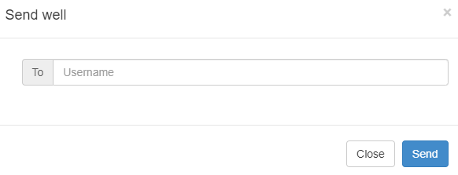

# Inicio de un nuevo proyecto

Al ingresar al software se deplegará la pantalla de administración de proyectos. Esta pantalla tiene dos paneles. En el panel de la izquierda están los proyectos que haya creado y en el panel de la derecha información básica sobre estos proyectos.

## Creación de un activo

En SYAL los diseños están organizados en activos, campos y pozos. Un activo puede tener uno o más campos y un campo puede tener uno o más pozos. 

Para crear un nuevo activo dar clic en el botón **Add Asset** ubicado en la cabecera del panel de la izquierda. 

En el panel de la derecha en el campo Name ingrese el nombre del activo, y en el campo Country seleccione el país en donde está ubicado este activo.

En la parte inferior del panel General Information tiene dos botones: 

**Add oilfield** crea un nuevo campo dentro del activo seleccionado.
**Delete asset** borra el activo seleccionado.

***Advertencia: Si borra un activo perderá el acceso a todos los campos y pozos asociados a ese activo.***

También puede crear un activo dando clic derecho en un activo existe. Esto desplegará un menu contextual con las opciones:

**Add asset** crea un nuevo activo
**Add oilfield** crea un nuevo campo en el activo seleccionado
**Delete asset** borra el activo seleccionado

## Creación de un campo

Puede crear un campo con las opciones descritas en la sección [Creación de un activo](#creación-de-un-activo). Usando el botón **Add oilfield** en el panel de información del activo, o en el menú contextual que aparece al dar clic derecho sobre el nombre de un activo existente.

Al crear un campo el panel General Information se actualizará para mostrar la información del campo. En el campo **Name** ingrese el nombre del campo. El campo **Country** toma el nombre del país al que pertenece el activo.

En la parte inferior del panel General Information tiene dos botones: 

**Add well** crea un nuevo pozo dentro del campo seleccionado.
**Delete oilfield** borra el campo seleccionado.

***Advertencia: Si borra un campo perderá el acceso a todos los pozos asociados a ese campo.***

También puede crear un campo dando clic derecho en nombre de un activo o campo existente, con esto se desplegará un menú contextual con las siguientes opciones:

**Add oilfield** crea un nuevo campo dentro del activo seleccionado.
**Add well** crea un nuevo pozo dentro del campo seleccionado.
**Delete oilfield** borra el campo seleccionado.

## Creación de un pozo

Puede crear un pozo con las opciones descritas en la sección [Creación de un campo](#creación-de-un-campo). Usando el botón **Add well** en el panel de información del campo, o en el menú contextual que aparace al dar clic derecho sobre el nombre de un campo existente.

Al dar click en el botón **Add well** se abrirá una nueva pantalla para iniciar la [configuración del pozo](pozo.md)

## Abrir un pozo

Al seleccionar un pozo el panel de información mostrará los siguientes botones:

**Edit** abre el pozo para su edición
**Delete well** borra el pozo
**Send well** envía una copia de ese pozo a otro usuario

## Enviar un pozo

Al dar click en el botón **Enviar pozo** se abrirá un panel en donde debe ingresar el nombre de usuario de la persona a la que quiere enviar una copia del pozo

Al dar clic en **Send** y si el nombre de usuario ingresado existe en la base datos de SYAL recibirá un mensaje de confirmación del envío exitoso del pozo.

La copia del pozo estará disponible en el panel de proyectos del usuario destinatario en un activo que contiene el nombre del usuario que envío el pozo y la fecha y hora del envío.

## Búsqueda de proyectos

En la parte superior del panel de proyectos tiene una herramienta de búsqueda. En este campo puede ingresar el nombre de un pozo y al dar clic en el botón **Search** se mostrará un listado con las coincidencias encontradas.

Los resultados de la búsqueda están dividivos en dos grupos. Pozos pertenecientes al usuario y pozos pertenecientes a otros usuarios. 

***Nota: La búsqueda en pozos de otros usuarios está habilitada solo para los colaboradores de SERTECPET.***

Los resultados de la búsqueda contienen información del activo y el campo al que pertenece cada pozo, asi como la fecha de creación del pozo. Al dar clic en unos de los resultados de la búsqueda se abrirá el pozo para su revisión o edición.

Si el pozo pertenece a otro usuario los resultados de la búsqueda también incluyen el nombre del usuario que creó el pozo. Al dar clic en un elemento de este grupo de resultados se creará una copia del pozo y se abrirá la copia para su revisión o edición. Es decir, los cambios realizados no afectarán al pozo original.

